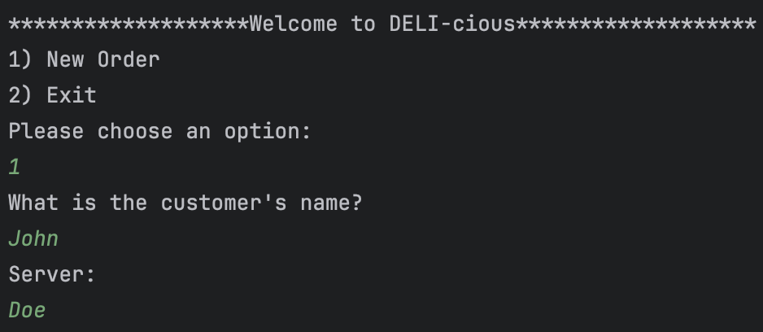

# CapstoneTwo_Deli

## Getting started

- To use this application you must have IntelliJ installed
- Open a new project using Maven, correto 17, Java
- Go to the terminal use the command (git clone) with the GitHub code HTTPS link

## Understanding the problem

- Inputs
    - User input

- Outputs
    - Command-Line Interface (CLI)
    - Creating an application that allows the user to make a new order and is able to select 4 menu otions add a
      sandwich, order a signature sandwich, checkout, add chips, add a drink, and to cancel an order.

## Making a plan

``
// Pseudocode
// Inputs
// Use Scanner to capture initial user menu command
// Display a welcome message to the user
// Prompt the user to choose between making a new order or exiting
// If a new order is chosen, ask for customer name and server name
// Present a menu with options: add sandwich, order signature sandwich, add drink, add chips, checkout, and cancel order
// For "add sandwich":
// - Allow user to select size, bread type, meat toppings, extra meat, cheese toppings, extra cheese, regular toppings, sauce, side, and toasting preference
// - Display itemized costs and total price before toppings
// When "checkout" is selected:
// - Display order summary including date, customer name, server name, sandwich selections, subtotal, tax, and total
// - Prompt for a tip and recalculate total price
// - Confirm or cancel the order and generate a receipt if confirmed
// Output the results to the CLI
``

## Developers Favorite piece of code

 

Signature Sandwich Interface / Bonus Feature 

This is my favorite piece of code because I was able to show that I could implement interfaces which we learned in
class.
I did not fully understand it at first but during the time to complete this capstone I took some time to gain a better
understanding.
Essentially I created a signature sandwich interface and a BLTSandwich class and a PhillyCheeseSteak class that
implements from the signature sandwich interface so that I could overwrite the methods to adjust it to each sandwich.

## SnapShots of the code working

 
 Snapshots 

### WELCOME

Welcome To Deli-cious

First menue the user sees and takes in the customer name and server name.

 

### Main Menu

Main Menu options

Customize Sandwich

Each sandwich size has a set price and the price is adjusted by the user selections.

### Order

 

Order Details 

 

 Receipt 

The receipt makes a new file an order is made and is stored by the date and time.

 

### Future Features

 List of Features 

- Add more sandwich options
- Include vegetarian and vegan options
- Add Junit testing 

